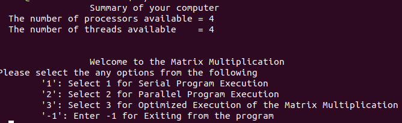
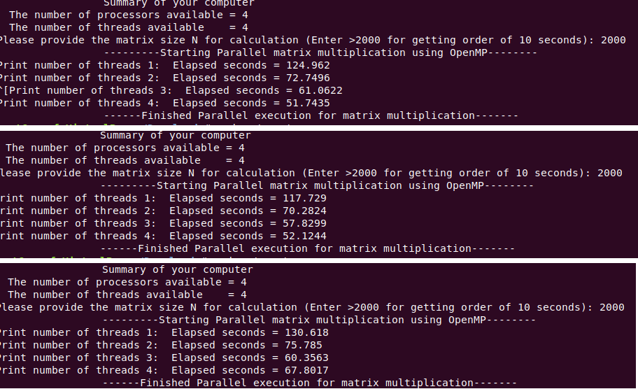
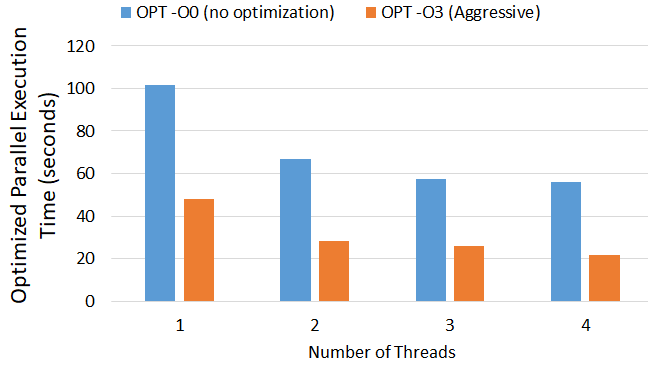

# Matrix Multiplication Execution Techniques using OpenMP

This project aims to evaluate and optimize the wall time of matrix multiplication using OpenMP, a multi-platform shared-memory multiprocessing programming API. The project explores three different execution techniques for matrix multiplication: serial execution, parallel execution using OpenMP, and optimized parallel execution.

## Contents

1. [Problem Statement](#problem-statement)
2. [Matrix Multiplication Execution Techniques](#matrix-multiplication-execution-techniques)
   - [Serial Execution](#serial-execution)
   - [Parallel Execution using OpenMP](#parallel-execution-using-openmp)
   - [Optimized Parallel Execution](#optimized-parallel-execution)
3. [Experimental Setup and Result Analysis](#experimental-setup-and-result-analysis)
   - [Experimental Setup](#experimental-setup)
   - [Experimental Result Analysis](#experimental-result-analysis)
     - [Serial Execution Results](#serial-execution-results)
     - [Parallel Execution Results using OpenMP](#parallel-execution-results-using-openmp)
     - [Optimized Parallel Execution Results](#optimized-parallel-execution-results)

## Problem Statement

Matrix multiplication must be implemented considering three different approaches:

- Serial Execution
- Parallel Execution using OpenMP
- Optimized Parallel Execution

Detailed problem description including the matrix representation and formulae for calculation can be found in the comprehensive project report.

### Matrix Multiplication Execution Techniques

#### Serial Execution

Serial execution involves executing instructions sequentially in a uniprocessor system.

#### Parallel Execution using OpenMP

This technique leverages OpenMP's parallel execution capabilities, following the fork-join model of parallel execution. Detailed assumptions for implementation are outlined in the report.

#### Optimized Parallel Execution

This approach focuses on optimizing memory access and variable sharing to enhance performance speed, testing different compiler optimization flags.

## Experimental Setup and Result Analysis

### Experimental Setup

Experiments were conducted using a console application created in C/C++ on an HP 14 laptop with the specifications detailed in the report. Matrix sizes ≥ 2000 are recommended to achieve a computation time order of ~10 seconds.

### Experimental Result Analysis

#### Serial Execution Results

Serial execution was the base case, running on a single core sequentially. Detailed results and a comparison graph can be found in the full report.

#### Parallel Execution Results using OpenMP

Parallel execution was facilitated using OpenMP loop parallelization, with dynamic scheduling and task migration among cores. The full report details performance impacts seen with different thread counts.

#### Optimized Parallel Execution Results

This part of the analysis involved GNU compiler optimization techniques, demonstrating significantly improved computation times with aggressive optimization flags.

## Findings

A comprehensive analysis of the findings is available in the report, showcasing the potential improvements in execution times across different techniques.

Please refer to the project report for detailed analysis, including graphical representations of performance comparisons and detailed insights into the execution times observed under various conditions.

*Figure 1: Matrix multiplication program interface*

*Figure 2: Serial vs. parallel execution comparison*

*Figure 3: Execution time for No Compiler Optimization and Aggressive Compiler Optimization*

## References

1. [OpenMP official website](https://www.openmp.org/)

Please read the project report for an in-depth understanding and feel free to contribute to further optimizations and insights.
